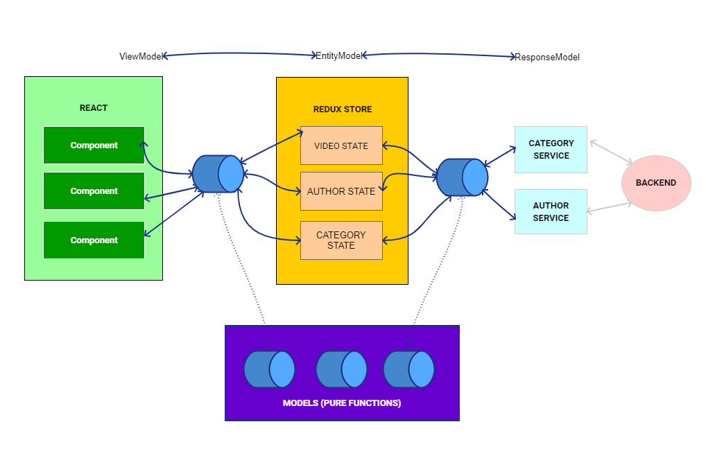

# Solution by Sharlon Balbalosa

### Hi!

This is my solution for the project test.  I enjoyed building this application although it is not perfect I was able to complete the required and optional task for this challenge. Below are the details regarding the technology stack, folder structure and missing items.

## Data flow diagram

### Instructions on how to run
* yarn install
* yarn start

### Implemented functionality

* Application Architecture to handle Authors, Categories and Videos.
* Create and update new video.
* Client side sorting for author and video name.
* Search function (GET request)
* Handle browser refresh
* Conditional HTTP request based on config

### Folder structure

* src/components - generic components
* src/features - components connected with redux and reducer
* src/services - backend api
* src/models - pure function for data transformations

### Technology stack used

* TypeScript (I love working with TS)
* @redux/toolkit for opinionated redux setup

### For improvement(Not Implemented, no more time)

* End to end testing using Cypress.
* Unit Test.
* Ingegration Test.
* Accessibility

I would love to have your feedback regarding the solution. If you have question or if for some reason the app doesn't run please let me know. (sbalbalosa@gmail.com)

Thanks,
Sharlon Balbalosa
